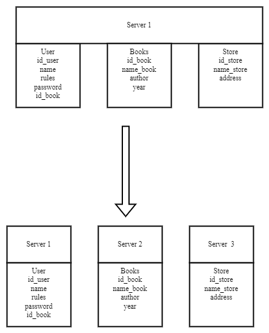
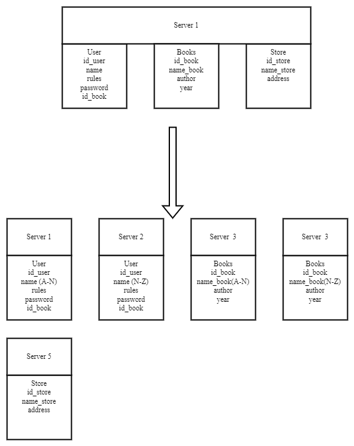

# Домашнее задание к занятию "`«Репликация и масштабирование. Часть 2»`" - `Дьяконов Алексей`

### Задание 1. Опишите основные преимущества использования масштабирования методами:

- 1. `Активный master-сервер и пассивный репликационный slave-сервер -  позволяет писать на мастер, а читать с мастера и слейва. Соответственно нагрузка на серверы меньше` 
- 2. `Master-сервер и несколько slave-серверов - практически то же самое, но больше серверов - соотвественно меньше нагрузка`
- 3. `Активный сервер со специальным механизмом репликации — distributed replicated block device (DRBD) - практически имеет смысл только  для репликации, так как блочное устройство может быть смонтировано только к одному хосту. Соотвественно, при его падении монтируется на другом, а затем там поднимается экземпляр Mysql или Postgres`
- 4. `SAN-кластер - так же имеет смысл для репликации и для HA-custera, так как блочное устройство может быть смонтировано только к одному хосту.`

### Задание 2.

1. `Вертикальный шардинг:`
-

2. `Горизонтальный шардинг:`
-